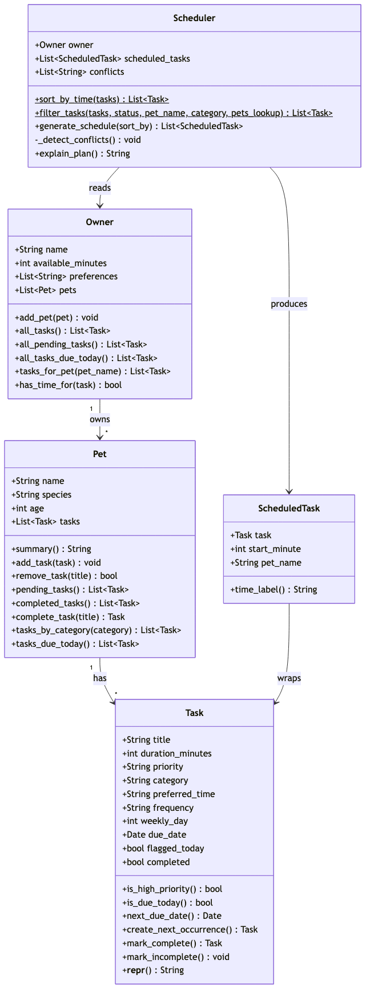
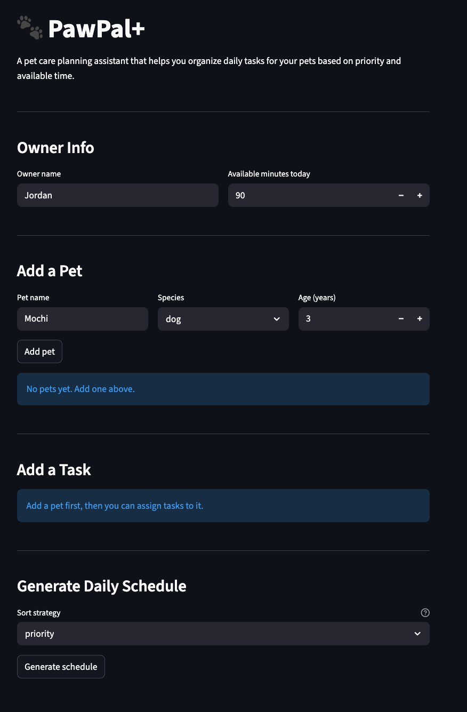

# PawPal+

A Streamlit-powered pet care scheduling assistant that helps busy owners plan, prioritize, and track daily care tasks across multiple pets.



## Demo

<a href="/course_images/ai110/pawpal_demo.png" target="_blank"></a>



## Features

### Multi-Pet Management

Register any number of pets (dog, cat, or other) with name, species, and age. Each pet maintains its own independent task list, and the scheduler aggregates them into a single daily plan for the owner.

### Four Sorting Strategies

The scheduler supports four `sort_by` modes so the owner can view their day the way that makes the most sense:

| Strategy | Algorithm | Use case |
|---|---|---|
| **priority** (default) | High → medium → low, then shortest duration as tiebreaker | Get the most important things done first |
| **time** | Chronological by `preferred_time` (HH:MM); splits the string into `(hours, minutes)` tuples for correct ordering; tasks without a time sort last | Plan around a fixed daily routine |
| **shortest_first** | Ascending duration | Knock out quick wins early |
| **longest_first** | Descending duration | Tackle big tasks while energy is high |

### Composable Task Filtering

`Scheduler.filter_tasks()` accepts any combination of three optional filters and chains them in a single pass:

- **Status** — show only pending or completed tasks
- **Pet** — narrow to a specific pet's tasks (uses object identity via `id()` for accuracy)
- **Category** — walk, feeding, medication, grooming, or enrichment

Filters are exposed in the UI as three side-by-side dropdowns above the task table.

### Daily Recurrence

Tasks have a `frequency` field (`daily`, `weekly`, or `as-needed`):

- **Daily** — completing the task auto-generates a new copy due the next day (`due_date + timedelta(days=1)`)
- **Weekly** — next occurrence is created 7 days later, pinned to the same `weekly_day`
- **As-needed** — no auto-recurrence; only appears in today's schedule when manually flagged via `flagged_today`

The UI confirms recurrence with an info banner showing the next due date.

### Conflict Detection

After building the schedule, `_detect_conflicts()` scans for two types of warnings:

1. **Same-time collision** — two tasks share an identical `preferred_time`. If they belong to the same pet, the warning names the pet; if they belong to different pets, it warns "owner can only be in one place."
2. **Back-to-back category** — consecutive scheduled tasks for the same pet in the same category (e.g., two walks in a row) are flagged so the owner can space them out.

Conflicts are displayed as `st.warning()` blocks in the schedule results — they never crash the scheduler.

### Time Budget Enforcement

The owner sets `available_minutes` for the day. The scheduler fills the plan greedily in sort order until time runs out:

- Tasks that fit are added to the schedule with a running `start_minute` offset
- Tasks that don't fit are listed as "skipped" with their duration and priority
- Summary metrics (scheduled / remaining / task count) are shown via `st.metric()` columns

### Task Completion Workflow

The UI lets the owner mark any pending task as complete from a dropdown. On completion:

1. The task's `completed` flag is set to `True`
2. If the task is recurring (daily or weekly), a fresh copy is appended to the pet's task list with the next due date
3. The page reruns to reflect the updated state

## Project Structure

```
pawpal_system.py    Core classes: Task, Pet, Owner, ScheduledTask, Scheduler
app.py              Streamlit UI — wires all backend features to interactive widgets
tests/test_pawpal.py  15 pytest tests covering sorting, recurrence, conflicts, and budget
class_diagram.md    Mermaid source for the UML class diagram
uml_final.png       Rendered UML diagram
```

## Getting Started

### Setup

```bash
python -m venv .venv
source .venv/bin/activate  # Windows: .venv\Scripts\activate
pip install -r requirements.txt
```

### Run the App

```bash
streamlit run app.py
```

### Run the Tests

```bash
python -m pytest tests/test_pawpal.py -v
```

## Testing

The test suite contains **15 tests** across four areas:

- **Sorting correctness** — verifies chronological ordering by `preferred_time`, empty-time-last behavior, priority sort, and shortest-first sort
- **Recurrence logic** — daily tasks produce a next-day copy, weekly tasks recur in 7 days, as-needed tasks return `None`, and `Pet.complete_task()` appends the next occurrence automatically
- **Conflict detection** — same-time collision for one pet, same-time collision across pets (with the cross-pet warning message), and back-to-back same-category flagging
- **Time budget / overflow** — tasks exceeding `available_minutes` are excluded; zero minutes yields an empty schedule without errors

### Confidence Level

**4 / 5 stars** — All core scheduling algorithms are tested and passing. The remaining gap is UI integration testing and validation of malformed inputs (e.g., invalid HH:MM strings).

## Architecture

See [class_diagram.md](class_diagram.md) for the Mermaid source or [uml_final.png](uml_final.png) for the rendered diagram.

Five classes collaborate to produce the daily plan:

- **Task** — a single pet care activity with priority, frequency, preferred time, and recurrence logic
- **Pet** — owns a list of tasks; provides filtered views (pending, completed, by category, due today)
- **Owner** — manages multiple pets; aggregates tasks across all pets and tracks available time
- **ScheduledTask** — pairs a Task with its start-minute offset and pet name in the daily plan
- **Scheduler** — the orchestrator: collects tasks due today, sorts them by the chosen strategy, fills the time budget, detects conflicts, and explains the plan
