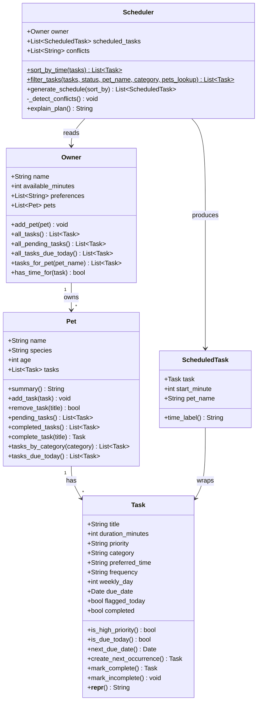

```mermaid
classDiagram
    class Task {
        +String title
        +int duration_minutes
        +String priority
        +String category
        +String preferred_time
        +String frequency
        +int weekly_day
        +Date due_date
        +bool flagged_today
        +bool completed
        +is_high_priority() bool
        +is_due_today() bool
        +next_due_date() Date
        +create_next_occurrence() Task
        +mark_complete() Task
        +mark_incomplete() void
        +__repr__() String
    }

    class Pet {
        +String name
        +String species
        +int age
        +List~Task~ tasks
        +summary() String
        +add_task(task) void
        +remove_task(title) bool
        +pending_tasks() List~Task~
        +completed_tasks() List~Task~
        +complete_task(title) Task
        +tasks_by_category(category) List~Task~
        +tasks_due_today() List~Task~
    }

    class Owner {
        +String name
        +int available_minutes
        +List~String~ preferences
        +List~Pet~ pets
        +add_pet(pet) void
        +all_tasks() List~Task~
        +all_pending_tasks() List~Task~
        +all_tasks_due_today() List~Task~
        +tasks_for_pet(pet_name) List~Task~
        +has_time_for(task) bool
    }

    class ScheduledTask {
        +Task task
        +int start_minute
        +String pet_name
        +time_label() String
    }

    class Scheduler {
        +Owner owner
        +List~ScheduledTask~ scheduled_tasks
        +List~String~ conflicts
        +sort_by_time(tasks)$ List~Task~
        +filter_tasks(tasks, status, pet_name, category, pets_lookup)$ List~Task~
        +generate_schedule(sort_by) List~ScheduledTask~
        -_detect_conflicts() void
        +explain_plan() String
    }

    Owner "1" --> "*" Pet : owns
    Pet "1" --> "*" Task : has
    ScheduledTask --> Task : wraps
    Scheduler --> Owner : reads
    Scheduler --> ScheduledTask : produces
```
