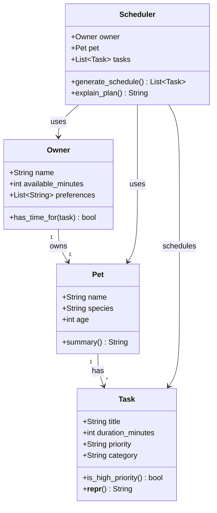

```mermaid
classDiagram
    class Owner {
        +String name
        +int available_minutes
        +List~String~ preferences
        +has_time_for(task) bool
    }

    class Pet {
        +String name
        +String species
        +int age
        +summary() String
    }

    class Task {
        +String title
        +int duration_minutes
        +String priority
        +String category
        +is_high_priority() bool
        +__repr__() String
    }

    class Scheduler {
        +Owner owner
        +Pet pet
        +List~Task~ tasks
        +generate_schedule() List~Task~
        +explain_plan() String
    }

    Owner "1" --> "1" Pet : owns
    Pet "1" --> "*" Task : has
    Scheduler --> Owner : uses
    Scheduler --> Pet : uses
    Scheduler --> Task : schedules
```
